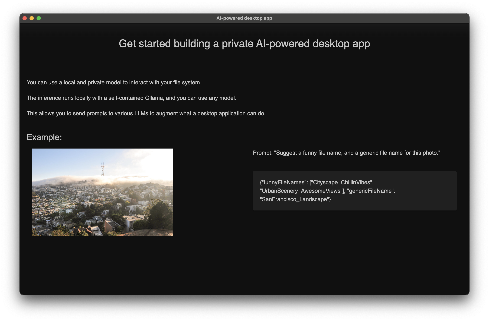

## Get started building a local and private AI-powered desktop app.

This repo is based off the amazing [chatd](https://github.com/BruceMacD/chatd/) project from the Ollama team. Their app provides a great way to interact with files, but the core is even better: running an LLM as a standalone desktop app. I've extracted that part into this small boilerplate repo, to allow anybody to get started quickly.

<div align="center">
    
</div>

## Development


```bash
npm install
npm run start
npx tailwindcss -i ./src/css/index-src.css -o ./src/css/index.css --watch
```

## Packaging and Distribution

### MacOS

1. Download the latest `ollama-darwin` release for MacOS from [here](https://github.com/jmorganca/ollama/releases).
2. Make the downloaded binary executable: `chmod +x path/to/ollama-darwin`
3. Copy the `ollama-darwin` executable to the `/src/service/ollama/runners` directory.
4. Optional: The Electron app needs be signed to be able to run on MacOS systems other than the one it was compiled on, so you need a developer certificate. To sign the app, set the following environment variables:

```bash
APPLE_ID=your_apple_id@example.com
APPLE_IDENTITY="Developer ID Application: Your Name (ABCDEF1234)"
APPLE_ID_PASSWORD=your_apple_id_app_specific_password
APPLE_TEAM_ID=ABCDEF1234
```

You can find your Apple ID, Apple Team ID, and Apple ID Application in your Apple Developer account. You can create an app-specific password [here](https://appleid.apple.com/account/manage).

5. Run `npm run package` to package the app.

### Windows

1. Build Ollama from source for Windows, this will support CPU only. See [here](https://github.com/jmorganca/ollama).
2. Copy the `ollama.exe` executable to `/src/service/ollama/runners/ollama.exe`.
3. Run `npm run package` to package the app.

Note: The Windows app is not signed, so you will get a warning when you run it.

### Linux

1. Build Ollama from source for Linux x64 to support CPU only, this allows for a smaller executable package. See [here](https://github.com/jmorganca/ollama).
2. Copy the `ollama` executable to `/src/service/ollama/runners/ollama-linux`.
3. Run `npm run package` to package the app.
